# Task 3 - Set up Crypto++ and OpenSSL

## Set up on Windows

### Task 3.1: Crypto++ set up

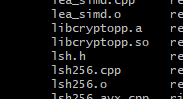

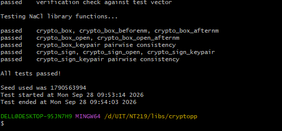

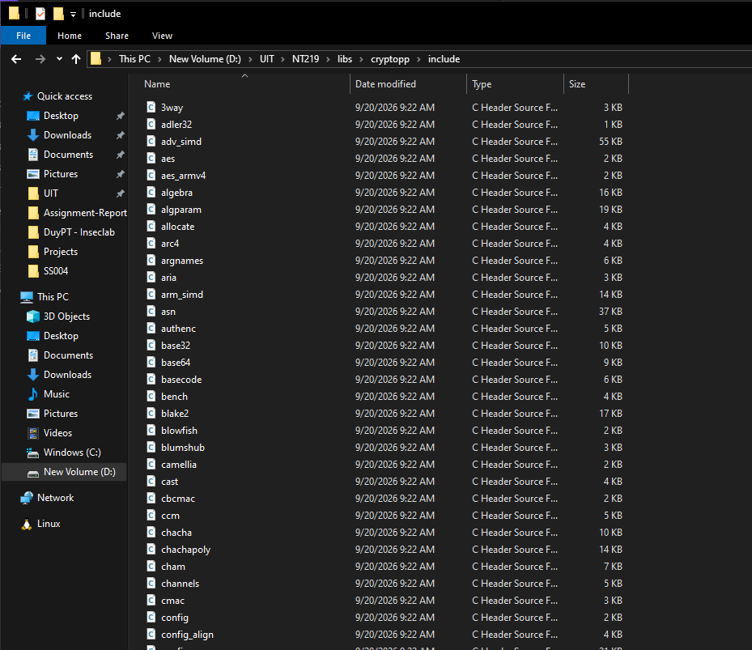

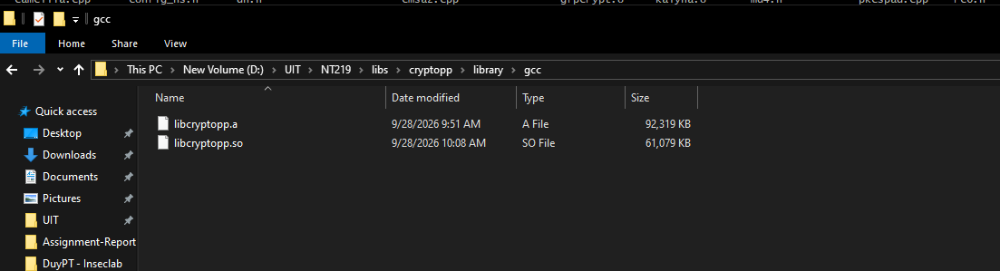

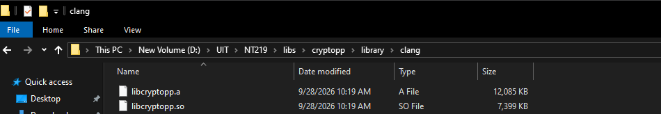

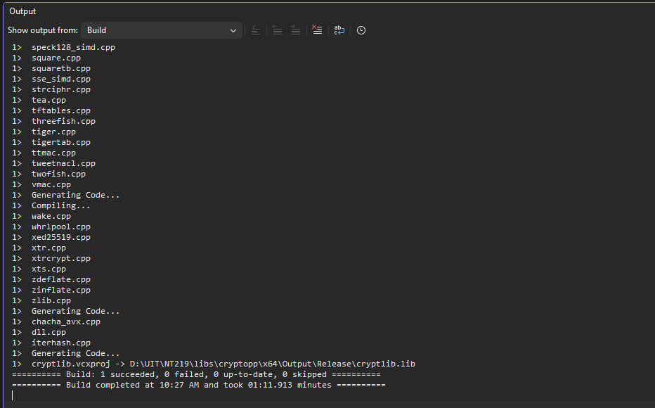

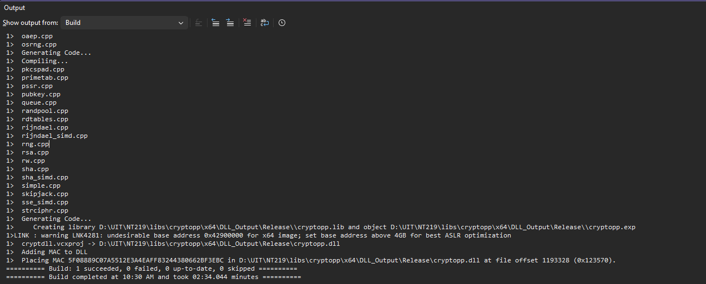

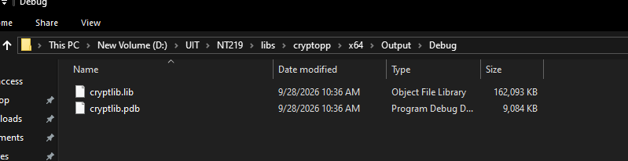

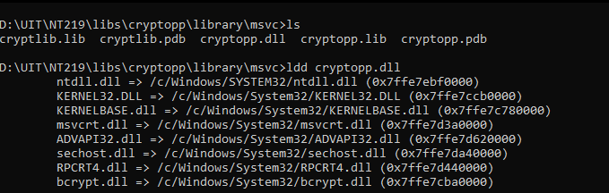

### Task 3.2: OpenSSL set up

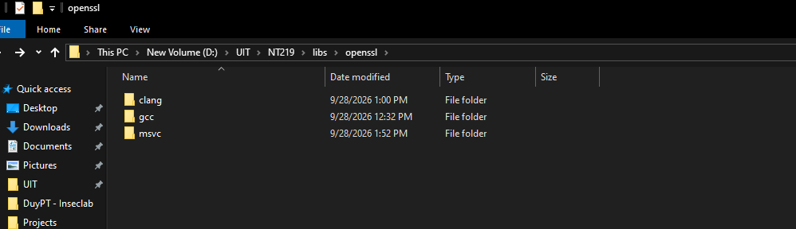

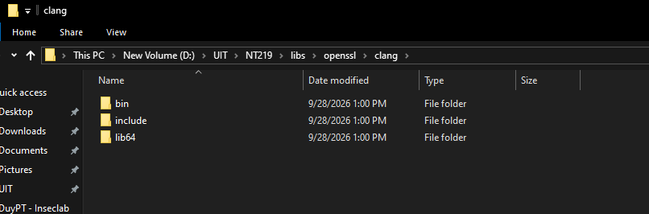

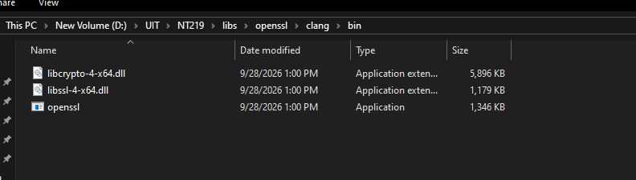

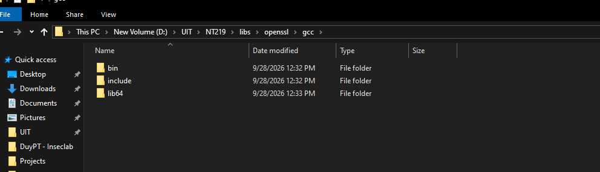

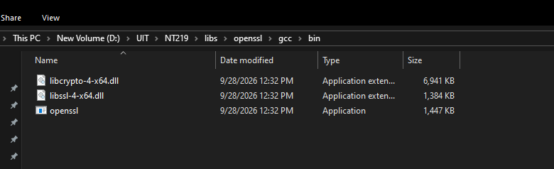

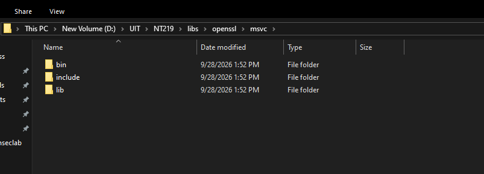

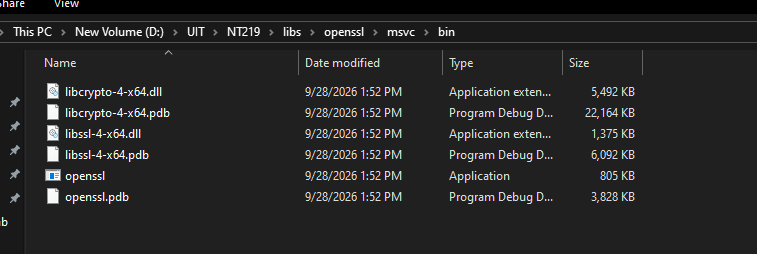

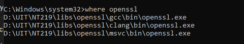

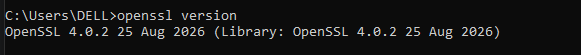

## Set up on Ubuntu

### Task 3.1: Crypto++ set up

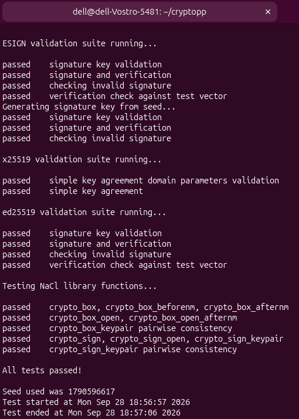

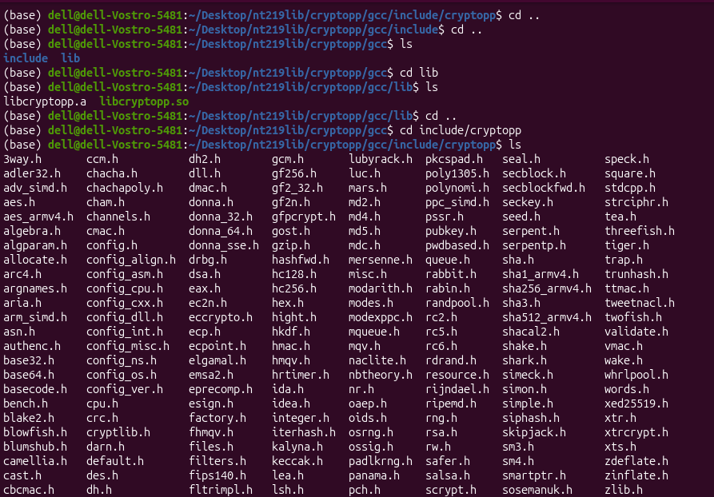

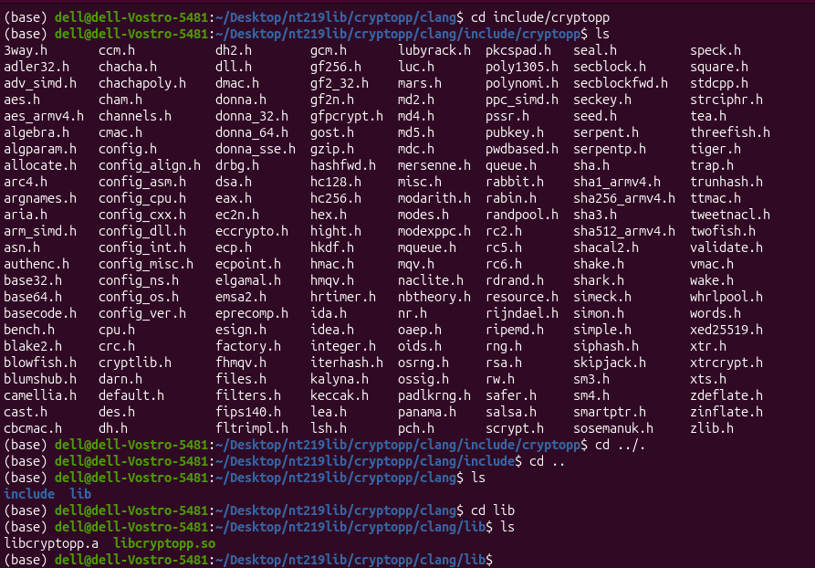

### Task 3.2: OpenSSL set up

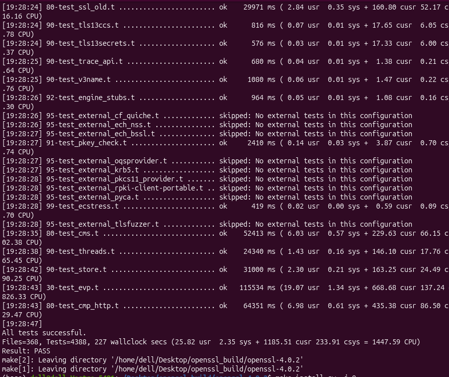

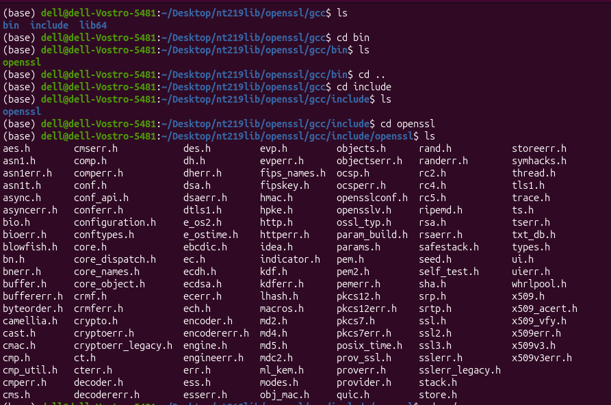

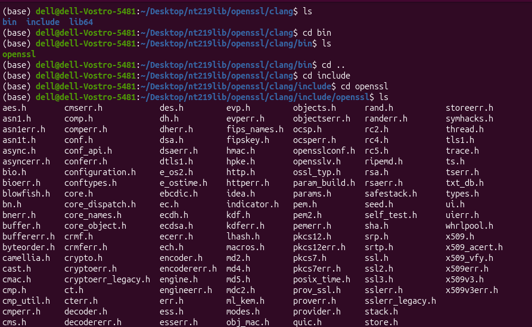